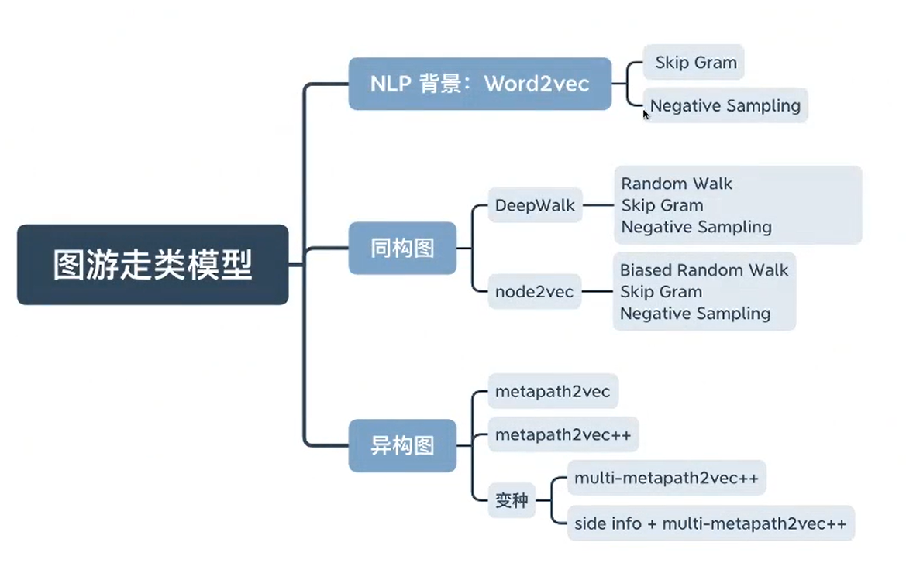
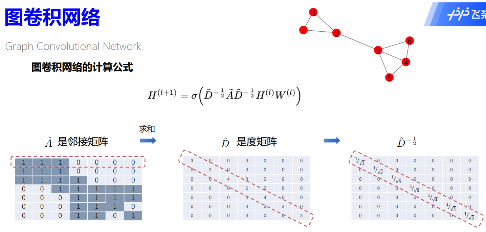

# 图神经网络
[toc]

## 第一天:图学习初印象

### 图
七桥问题
图的表示：G =(V,E) 
图是一种统一描述复杂事物的语言

图学习：
一般深度学习：难以处理不规则数据
图学习：可以方便处理不规则数据（图）

节点级别任务---金融诈骗检测，目标检测（自动驾驶）
边级别任务---推荐系统
图级别任务---气味识别

### 图学习是如何做的
1.图游走类算法（第二天内容）
2.图神经网络算法---消息传递（第三天内容）

### 图学习框架---PGL

基于GAT的网页反作弊项目

### 总结

### 番外

## 第二天：图游走类算法
**图游走类算法**

图游走类模型最开始参考的就是 NLP领域：**Word2vec**
### Word2vec
1.Skip Gram：根据中心词预测上下文

2.Negative Sampling（负采样）

解决计算量大的问题

随机采样选取负样本

### Word2vec -> 图嵌入领域
通常，图中的节点会受到其邻居的影响

### 图游走类模型 --- DeepWalk

改进：

### 概念
#### 同构图游走

#### 异构图游走

异构图表示：G=(V,E,T)

方法：**metapath2vec：meta path（元路径）**

在图中选取的由节点类型构成的组合路径

* 元路径具有对称性

* 缺点：负采样的时候，没有考虑节点类型

方法改进：**metapath2vec++**

* 负采样的时候，考虑了节点类型

### 总结

## 第三天：图神经网络算法(一)

### GCN
#### 图像卷积与图结构卷积
图像卷积    ：将一个**像素点**周围的**像素**按照不同的**权重叠加**起来。
图结构卷积：将一个  **节点**  周围的**邻居**按照不同的**权重叠加**起来。

#### 图卷积网络计算公式

#### 消息传递Message Passing
Send：边上的源节点，往目标节点发送特征
Recv：目标节点对收到的特征进行聚合

**衡量邻居的重要性---度**

#### 节点分类任务

### GAT

GCN中边的权重：
- 与节点的度相关
- 不可学习

#### attention计算公式

### Message Passing

### 总结

## 第四天 图神经网络算法(二)

### 图采样算法

### 邻居聚合

单射可以保证对聚合后的结果可区分

#### GIN

### 总结

